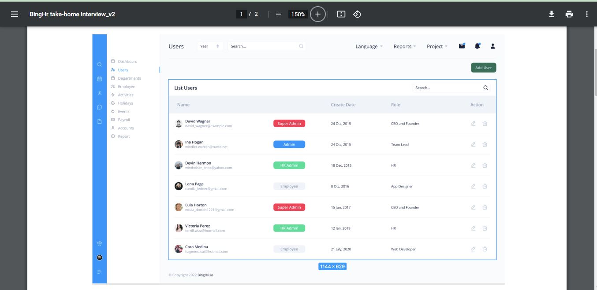
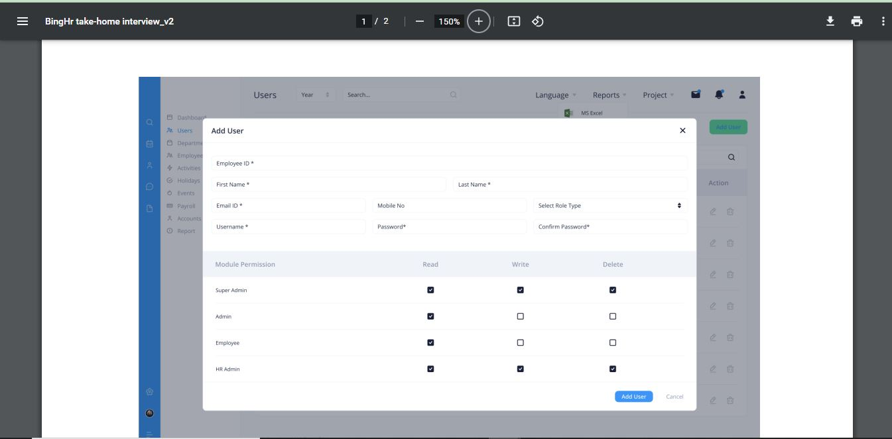

## full stack test exercise

## outcomes

##Step 1 RUNNING APPLICATION
- CLONE THE REPO
- CD INTO FRONTEND FOLDER => RUN COMMAND : 
-  npm install --legacy-peer-deps
- CD INTO BACKEND FOLDER => RUN COMMAND : 
-  composer install --ignore-platform-reqs

##Step 2 Note to completely install backend
- you need to run migration tables and default seeder
-to migrate run : php artisan migrate 
  if migration fails rerun the migration command
  this failure can occur up to 3 times due to oauth token db being generated by laravel passport. after running the migration about 3-4 times it should succeed

 - next run the command php artisan db:seed to seed default user tables with roles and previledges

## Step 3 to launch application
frontend: npm run start:dev
backend: php artisan serve

## TASK ASSIGNMENT REVIEW 

## I have attached two images for the take-home exercise. 

- The first image should be the
entry page for your application. As you can see, we have the side menu and top bar,
and a couple of menu items list. Make sure you design everything you see on the page.
- Users should be able to collapse and extend the menu, which will adjust the page's
content. 
- The component we are more interested in for implementing functionality is the
user's menu. 
- It should show the lists of users in the database in a tabulated form with a
search bar at the top right of the table.
- A user should be able to perform a CRUD operation on the application. There is a 'Add
- User' button at the top corner; when clicked should display a modal, as seen in the
second attached image.
- We also have an Action column in the table where a user can click on the delete icon to
delete a user and an edit icon where a user can click to display the second image but
pre-fill with the user's info. At that point, the 'Add User' should be replaced with 'Update
User'.

## Deliverables:
- Every bit of the design in the image above must be the same as the one in your
application.
- The entry point must be the user’s list, where the Users menu is highlighted by
default.
- A user should be able to add users, including their permission.
- A user should be able to delete users.
- A user should be able to update a user.
- Feel free to add extra functionality as you see fit if you have the time.

-Technologies: The application should be built with Laravel, HTML, CSS, and Javascript
(Jquery). You can use the material UI/bootstrap/Tailwind framework if you wish.
- Mode of submission: Create a public repo on Github and push your work to it; Please,
kindly commit and push your work progressively. Commit as you get things done, don’t
just commit and push everything all at once. When you are done, please write a readMe
to explain what you have done and how to start your application, and the things you

- would like us to note.

- Deadline: 3 days.